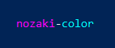
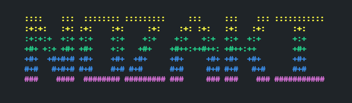

# nozaki-colors
Another node cli colors module. Done simply and with native syntax. 
It's ment to make sense to engineers, not script kiddies.

This works in the chrome browser console as well.

***As you might know... windows is a special snowflake. Blink and bold don't always work well.***

# examples

### Basic

Use a color name as the open tag for the color, and an `end` as the closing tag for the color.



```js
import {color,background,style,resetAllColors} from 'nozaki-colors';

console.log(`

    ${color.magenta}nozaki${color.end}-${color.cyan}color${color.end}

`);

```

### Browser example

```js
import {color,background,style,resetAllColors} from '../node_mopdeules/nozaki-colors/color.js';

console.log(`

    ${color.magenta}nozaki${color.end}-${color.cyan}color${color.end}

`);

```


### Cascading

Black and white backgrounds can be altered with the users terminal theme. 
Note, the image below has a dark blue as the background when black is specified.




```js
import {color,background,style,resetAllColors} from 'nozaki-colors';

console.log(
    `${background.black}

    ${color.yellow}::::    :::  :::::::: :::::::::     :::     :::    ::: ::::::::::: 
    ${color.lightYellow}:+:+:   :+: :+:    :+:     :+:    :+: :+:   :+:   :+:      :+:     
    ${color.lightGreen}:+:+:+  +:+ +:+    +:+    +:+    +:+   +:+  +:+  +:+       +:+     
    ${color.green}+#+ +:+ +#+ +#+    +:+   +#+    +#++:++#++: +#++:++        +#+     
    ${color.blue}+#+  +#+#+# +#+    +#+  +#+     +#+     +#+ +#+  +#+       +#+     
    ${color.lightBlue}#+#   #+#+# #+#    #+# #+#      #+#     #+# #+#   #+#      #+#     
    ${color.lightMagenta}###    ####  ######## ######### ###     ### ###    ### ###########

    ${resetAllColors}`
)

```

## Styles
It is important to note not all styles work on windows. 
Some OS's have slightly different implementations.


### Underline

```js
import {color,background,style,resetAllColors} from 'nozaki-colors';

console.log(`${background.yellow}

Visit nozaki's website!
    ${style.underlineOn}${color.blue}http://nozaki.ninja${color.end}

${resetAllColors}`);

```


# Docs

----
### Text Color

|color|
|-|
|end| 
|black|   
|white| 
|red| 
|green| 
|blue|
|cyan|
|magenta| 
|yellow|
|lightGray|   
|lightWhite|  
|lightRed|
|lightGreen|
|lightBlue|
|lightCyan|  
|lightMagenta|
|lightYellow|

----
### Text Style

|style|
|-|
|boldOn|  
|boldOff| 
|underlineOff|
|underlineOn|
|blinkOn| 
|blinkOff|

----
### Background Color / Highlight

|background|
|-|
|end| 
|black|   
|White|  
|red| 
|blue|
|green|
|cyan|
|magenta| 
|yellow|
|lightGray|   
|lightWhite|  
|lightRed|
|lightGreen|
|lightBlue| 
|lightCyan| 
|lightMagenta|
|lightYellow|

----
